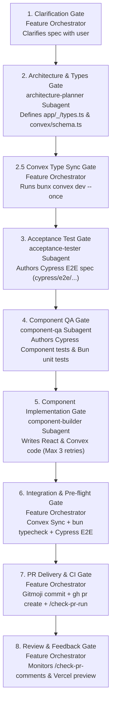

# Feature Engineering Multi-Agent Protocol

When activated, the **Feature Orchestrator** directly coordinates specialized worker subagents (`.agents/*.md`) across an 8-step quality-gated lifecycle to deliver robust, fully-tested features for Banerry.

## Workflow Lifecycle Architecture

---

## Step-by-Step Lifecycle & Process Gates

| Step | Gate Name | Responsible Agent | Actions & Requirements |
| :--- | :--- | :--- | :--- |
| **1** | **Clarification & Alignment** | **Feature Orchestrator** | Reads spec file, asks user clarifying questions to resolve ambiguities *before* spawning worker subagents. |
| **2** | **Architecture & Types** | **`architecture-planner`** *(Subagent)* | Defines `app/_<feature>/types.ts`, `convex/schema.ts`, file stubs, and establishes UI `data-name` contracts. |
| **2.5** | **Convex Type Generation** | **Feature Orchestrator** | Runs `bunx convex dev --once` immediately after schema changes so backend types (`convex/_generated/api.d.ts`) exist before UI work starts. |
| **3** | **Acceptance Test Constraints** | **`acceptance-tester`** *(Subagent)* | Authors route-mirroring Cypress E2E spec in `cypress/e2e/` with PostHog assertions matching the planner's `data-name` contracts. |
| **4** | **Component Unit QA** | **`component-qa`** *(Subagent)* | Writes failing Cypress Component specs (`cypress/component/**/*.cy.tsx`) for UI and Bun tests (`*.test.ts`) for pure logic. |
| **5** | **Component Implementation** | **`component-builder`** *(Subagent)* | Implements React UI & Convex functions to pass unit tests (`bun test`). **Read-only on test files.** Max 3 retries before escalating back to Orchestrator. |
| **6** | **Integration & Pre-Flight** | **Feature Orchestrator** | Syncs Convex backend (`bunx convex dev --once`), runs `bun run typecheck`, `bun run lint`, and full Cypress suite (`bun run integration`). |
| **7** | **PR Delivery & CI Watch** | **Feature Orchestrator** | Commits using Gitmoji format (`✨`), pushes branch, opens PR (`gh pr create`), and monitors GitHub Actions pipeline via `/check-pr-run`. |
| **8** | **PR Review & Comment Watching** | **Feature Orchestrator** | Listens for human PR comments and Vercel preview feedback via `/check-pr-comments`, delegating fixes back to Step 4/5 as needed. |

---

## Core Execution Rules

1. **Flat Subagent Hierarchy (1-Level Deep):** The Feature Orchestrator directly invokes worker subagents. Subagents **MUST NOT** spawn sub-subagents via `define_subagent` or `invoke_subagent`.
2. **Single Git Authority:** **ONLY** the Orchestrator executes `git commit`, `git push`, or `gh pr create`. Subagents are strictly restricted from Git mutations to prevent index locks.
3. **Convex Pre-Flight Type Sync:** Always run `bunx convex dev --once` immediately after `convex/schema.ts` updates, before component development begins.
4. **No Background Task Polling:** Do **NOT** poll `manage_task` in a loop; wait for system completion notifications.
5. **Architectural & Testing Conventions:**
   - **Module Paths:** Co-locate code under `app/_<feature>/` (e.g. `app/_canvas/types.ts`).
   - **Cypress Route Mirroring:** Specs mirror route path (e.g. `/learner/[passphrase]/canvas` $\rightarrow$ `cypress/e2e/learner/passphrase/canvas.cy.ts`).
   - **Cypress Component vs. Bun Unit:** Use Cypress Component tests (`cypress/component/`) for UI components, and Bun unit tests (`*.test.ts`) for pure logic.
   - **Gitmoji Commit Formatting:** Raw Unicode Gitmoji (`✨`, `🐛`, `📝`, `♻️`) without Conventional Commit prefixes (`feat:`, `fix:`, `docs:`).
   - **Package Runner:** Use `bun` / `bunx` exclusively — never `npm` / `npx`.
