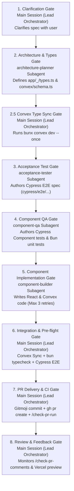

# CLAUDE.md

@~/code/convex.md

## Project Overview

Banerry is a communication assistance app for visual and gestalt language learners. It's built as a Progressive Web App (PWA) using Next.js 15 with React 19, Convex for backend/database, and Convex Auth for authentication.

## Development Commands

```
bun dev              # Start frontend + backend in parallel
bun dev:frontend     # Next.js dev server only (port 6604)
bun dev:backend      # Convex dev server only
bun typecheck        # Run TypeScript compiler
bun lint             # Run ESLint
bun format           # Run Prettier
bun unit             # Run Bun unit tests
bun integration      # Run Cypress E2E tests
bun test             # Run all checks (typecheck, lint, unit, integration)
bun run build        # Build for production
```

Run a single unit test:
```
bun test app/_image-generation/parse-board-prompt.test.ts
```

Run a single Cypress spec:
```
bun --env-file .env.test --env-file .env.test.local cypress run --spec cypress/e2e/mentor.cy.ts
```

Always use `bun` / `bunx` as the package runner — never `npm` / `npx`.

### Husky Hooks

- **pre-commit**: `bun test` (typecheck + lint + unit + integration)
- **pre-push**: `bun run integration` (Cypress E2E only)

## Architecture

### Dual Access Pattern

The app has two distinct access modes:

- **Mentors** (parents, teachers, therapists) authenticate via email OTP using Convex Auth. They manage learners, scripts, boards, and invitations under `/mentor/*` routes.
- **Learners** access the app without authentication via a passphrase (three random words joined by dashes, e.g. `elephant-purple-dancing`). The passphrase is stored in `localStorage` and all learner routes live under `/learner/[passphrase]/*`.

### Authorization

Authorization helpers live in `convex/learners.ts`:

- `ensureAuthenticated(ctx)` — throws if user is not logged in
- `ensureLearnerRelationship(ctx, learnerId)` — throws if the authenticated user has no mentor-learner relationship with the given learner

Learner-facing queries use the `by_passphrase` index and require no authentication.

### Underscore-Prefix Convention

Shared modules in `app/` use an underscore prefix to indicate they are not routes:

- `app/_common/` — shared UI components, hooks, navigation
- `app/_tts/` — text-to-speech (OpenAI TTS, audio caching, voice context)
- `app/_scripts/` — script management UI (mentor-facing)
- `app/_target-scripts/` — target script UI (learner goals)
- `app/_boards/` — board/visual schedule management
- `app/_learners/` — learner-specific utilities
- `app/_mitigations/` — mitigation/interpretation UI
- `app/_image-generation/` — AI image generation for avatars and boards
- `app/_posthog/` — PostHog analytics provider

### Tech Stack

- **Next.js 15** with App Router, **React 19**, **TypeScript**
- **Tailwind CSS**, **Radix UI**, **Shadcn/ui** (`components/ui/`)
- **Convex** for real-time database and backend functions
- **Convex Auth** with Resend OTP (email-based, 8-digit code)
- **OpenAI API** for TTS (`app/_tts/`) and image generation
- **ElevenLabs** ConvAI widget integration
- **PostHog** for analytics
- PWA with service worker and manifest

## Database Schema (Convex)

Tables in `convex/schema.ts` (plus `authTables` from `@convex-dev/auth`):

| Table | Purpose |
|---|---|
| `learners` | Learner profiles (name, bio, avatar, passphrase). Index: `by_passphrase` |
| `learnerMentorRelationships` | Links mentors to learners. Indexes: `by_learner`, `by_mentor` |
| `learnerInvitations` | Email invitations to join as mentor for a learner. Indexes: `by_email`, `by_token`, `by_learner` |
| `scripts` | Gestalt scripts (dialogue + parentheticals) per learner. Index: `by_learner` |
| `targetScripts` | Target/goal scripts per learner. Index: `by_learner` |
| `boards` | Visual schedule boards with columns. Indexes: `by_learner`, `by_learner_active` |

## Testing

**New functionality must include tests.** For every feature or UI change, add the appropriate test coverage:

- Pure logic / parsing → Bun unit test alongside the source file
- Stateless UI component → Cypress component test
- End-to-end user flow → Cypress E2E test
- Most features need both a component test and an E2E test

### Unit Tests (Bun)

Bun's built-in test runner. Test files live alongside source code with `.test.ts` suffix (e.g. `app/_image-generation/parse-board-prompt.test.ts`).

### Component Tests (Cypress)

Test isolated UI components without a running server. Tests live under `cypress/component/` mirroring the source path. Components that depend on Convex should expose a pure display variant (accepting callbacks as props) so it can be tested without a live backend.

```
cypress/component/
  _common/timer.cy.tsx              # app/_common/timer.tsx
  mentor/learner/id/
    activity-card.cy.tsx            # MentorActivityCardDisplay
```

Run component tests:
```
bunx cypress run --component
```

Run a single component spec:
```
bunx cypress run --component --spec cypress/component/mentor/learner/id/activity-card.cy.tsx
```

### E2E Tests (Cypress)

Tests are organized to mirror the route they test:

```
cypress/e2e/
  signin.cy.ts                          # /signin
  learner.cy.ts                         # /learner
  mentor.cy.ts                          # /mentor
  mentor/learner/id.cy.ts               # /mentor/learner/[id]
  mentor/learner/id/boards.cy.ts        # /mentor/learner/[id]/boards
  mentor/learner/id/scripts.cy.ts       # /mentor/learner/[id]/scripts
  mentor/learner/id/timer.cy.ts         # /mentor/learner/[id]/timer
  mentor/learner/id/activities.cy.ts    # /mentor/learner/[id]/activities
  invitation/token.cy.ts               # /invitation/[token]
```

#### Custom Commands (`cypress/support/commands.ts`)

Available in both E2E and component tests:

- `cy.signIn(email)` — signs in with OTP using `CYPRESS_OTP_OVERRIDE` env var
- `cy.createLearner(name, bio?)` — creates a new learner through the UI
- `cy.getByName(name)` — shorthand for `cy.get([data-name="..."])`

#### Conventions

- **Test emails**: use `cypress-*@banerry.app` (e.g. `cypress-test@banerry.app`)
- **Element selectors**: use `data-name` attributes, never CSS classes or tag-based selectors
- **Setup**: each test suite resets state via `cy.task('resetCypressUsers')` and `cy.task('clearVerificationCodes')` in `beforeEach` (configured in `cypress/support/e2e.ts`)
- **Convex test helpers**: `convex/testing.ts` provides `resetCypressUsers` and `clearVerificationCodes` tasks
- **API stubs**: use `cy.intercept()` to stub `/api/generate-image` and similar slow/costly endpoints in tests

## Multi-Agent Feature Engineering Protocol

When building features using multi-agent orchestration, the **Main Session (Lead Orchestrator)** directly coordinates specialized worker subagents (`.agents/*.md`) across an 8-step quality-gated lifecycle.

### Workflow Lifecycle Architecture



---

### Step-by-Step Lifecycle & Process Gates

| Step | Gate Name | Responsible Agent | Actions & Requirements |
| :--- | :--- | :--- | :--- |
| **1** | **Clarification & Alignment** | **Main Session** *(Lead Orchestrator)* | Reads spec file, asks user clarifying questions to resolve ambiguities *before* writing code/tests. |
| **2** | **Architecture & Types** | **`architecture-planner`** *(Subagent)* | Defines `app/_<feature>/types.ts`, `convex/schema.ts`, file stubs, and establishes UI `data-name` contracts. |
| **2.5** | **Convex Type Generation** | **Main Session** *(Lead Orchestrator)* | Runs `bunx convex dev --once` immediately after schema changes so backend types (`convex/_generated/api.d.ts`) exist before UI work starts. |
| **3** | **Acceptance Test Constraints** | **`acceptance-tester`** *(Subagent)* | Authors route-mirroring Cypress E2E spec in `cypress/e2e/` with PostHog assertions matching the planner's `data-name` contracts. |
| **4** | **Component Unit QA** | **`component-qa`** *(Subagent)* | Writes failing Cypress Component specs (`cypress/component/**/*.cy.tsx`) for UI and Bun tests (`*.test.ts`) for pure logic. |
| **5** | **Component Implementation** | **`component-builder`** *(Subagent)* | Implements React UI & Convex functions to pass unit tests (`bun test`). **Read-only on test files.** Max 3 retries before escalating to Lead Orchestrator. |
| **6** | **Integration & Pre-Flight** | **Main Session** *(Lead Orchestrator)* | Syncs Convex backend (`bunx convex dev --once`), runs `bun run typecheck`, `bun run lint`, and full Cypress suite (`bun run integration`). |
| **7** | **PR Delivery & CI Watch** | **Main Session** *(Lead Orchestrator)* | Commits using Gitmoji format (`✨`), pushes branch, opens PR (`gh pr create`), and monitors GitHub Actions pipeline via `/check-pr-run`. |
| **8** | **PR Review & Comment Watching** | **Main Session** *(Lead Orchestrator)* | Listens for human PR comments and Vercel preview feedback via `/check-pr-comments`, delegating fixes back to Step 4/5 as needed. |

---

### Core Execution Rules

1. **Flat Subagent Hierarchy (1-Level Deep):** The Lead Orchestrator directly invokes worker subagents. Subagents **MUST NOT** spawn sub-subagents via `define_subagent` or `invoke_subagent`.
2. **Single Git Authority:** **ONLY** the Lead Orchestrator executes `git commit`, `git push`, or `gh pr create`. Subagents are strictly restricted from Git mutations to prevent index locks.
3. **Convex Pre-Flight Type Sync:** Always run `bunx convex dev --once` immediately after `convex/schema.ts` updates, before component development begins.
4. **No Background Task Polling:** Do **NOT** poll `manage_task` in a loop; wait for system completion notifications.
5. **Architectural & Testing Conventions:**
   - **Module Paths:** Co-locate code under `app/_<feature>/` (e.g. `app/_canvas/types.ts`).
   - **Cypress Route Mirroring:** Specs mirror route path (e.g. `/learner/[passphrase]/canvas` $\rightarrow$ `cypress/e2e/learner/passphrase/canvas.cy.ts`).
   - **Cypress Component vs. Bun Unit:** Use Cypress Component tests (`cypress/component/`) for UI components, and Bun unit tests (`*.test.ts`) for pure logic.
   - **Gitmoji Commit Formatting:** Raw Unicode Gitmoji (`✨`, `🐛`, `📝`, `♻️`) without Conventional Commit prefixes (`feat:`, `fix:`, `docs:`).
   - **Package Runner:** Use `bun` / `bunx` exclusively — never `npm` / `npx`.


